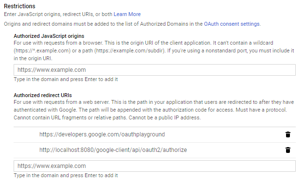

# Google Admin SDK Client

Set up the redirect URI in the Google Developers Console. In our case:

```
http://localhost:8080/google-client/api/oauth2/authorize
```



## References

1. [OAuth 2.0 Playground](https://developers.google.com/oauthplayground)
1. [Google Developers Console: APIs & Services](https://console.developers.google.com/apis/credentials/)
1. [OAuth 2 client Google sample in WebApp deployment](https://github.com/jersey/jersey/tree/master/examples/oauth2-client-google-webapp)
1. [Eclipse Jersey Project](https://github.com/eclipse-ee4j/jersey)
1. [Eclipse Jersey Project Wiki](https://github.com/eclipse-ee4j/jersey/wiki)
